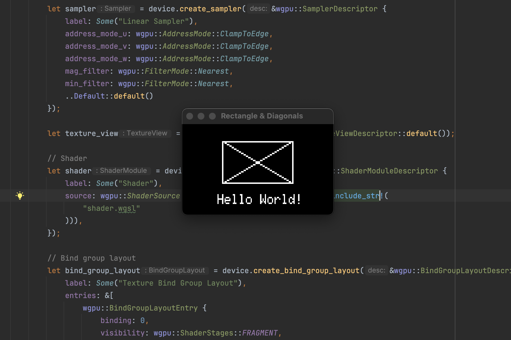

# vssd1306


A virtual SSD1306 display driver for Rust, supporting `embedded-graphics` and an optional WGPU-powered window for simulation.

## Features

- **SSD1306 Emulation**: Implements display geometry, rotation, and brightness.
- **Embedded Graphics**: Full support for the `embedded-graphics` 2D drawing library.
- **Virtual Window**: Optional `window` feature to visualize the display output using `wgpu` and `winit`.

## Preview



## Usage

Add this to your `Cargo.toml`:

```toml
[dependencies]
vssd1306 = "0.1.0"
```

To enable the virtual window simulation:

```toml
[dependencies]
vssd1306 = { version = "0.1.0", features = ["window"] }
```

## Example

```rust
use vssd1306::display::core::VirtualDisplay;
use embedded_graphics::prelude::*;
use embedded_graphics::primitives::{Rectangle, PrimitiveStyle};
use embedded_graphics::pixelcolor::BinaryColor;

fn main() {
    let mut display = VirtualDisplay::new(128, 64);
    
    Rectangle::new(Point::new(10, 10), Size::new(50, 30))
        .into_styled(PrimitiveStyle::with_stroke(BinaryColor::On, 1))
        .draw(&mut display)
        .unwrap();
}
```

## License
This project is licensed under the MIT License.
